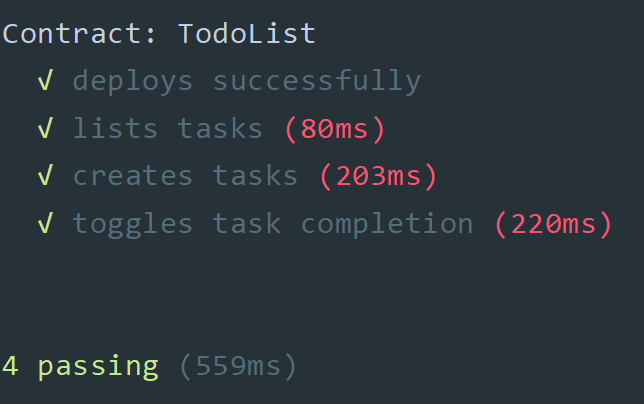
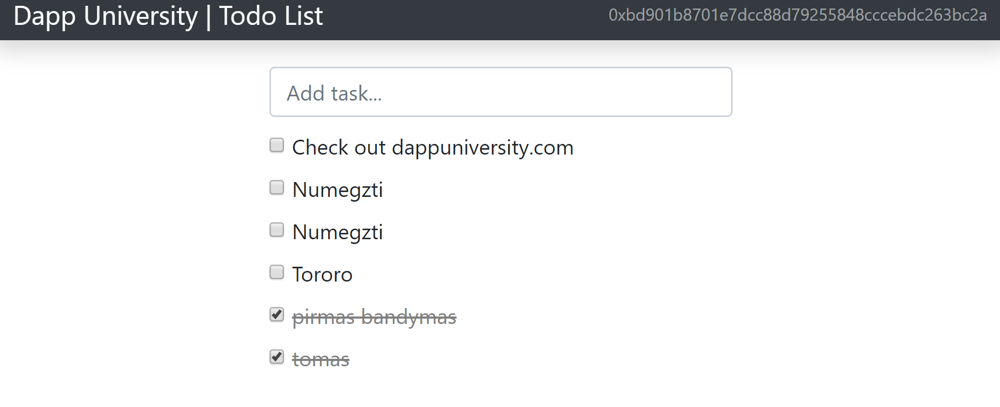

# smart-contract, ToDoList

## Įdiegimas (Unix kompiuteryje) 

- `git clone https://github.com/ToNyHasK/smart-contract.git`
- `cd smart-contract`

## Užduoties formuluotė
https://github.com/blockchain-group/Blockchain-technologijos/blob/master/pratybos/4uzduotis-SmartContract.md

## Tikslas

Pagrindinis šios užduoties tikslas yra sukurti išmaniąją sutartį (angl. *smart contract*), kuri įgyvendintų tam tikrą verslo logiką ir galėtų užtikrinti jos "saugų" ir "patikimą" funkcionavimą decentralizuotame viešąjame tinkle. Išmaniosios sutarties valdymui ir verslo proceso dalyvių tarpusavio sąveikai palengvinti bus kuriama decentralizuota aplikacija su `Front-End`.

### Versijos:

### [v0.1](https://github.com/ToNyHasK/smart-contract/releases/tag/v0.1) - (2019-01-11)

* initial
* ToDoList pagrindas

### [v0.2](https://github.com/ToNyHasK/smart-contract/releases/tag/v0.2) - (2019-01-13)

* Padaryti testai

* Padarytas interfeisas
